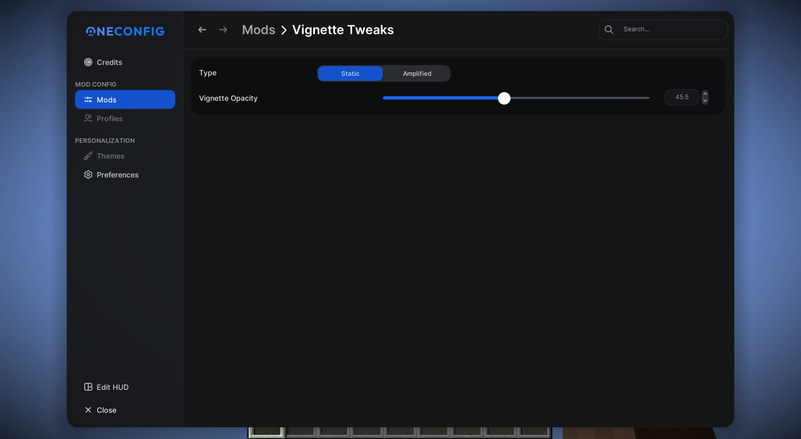
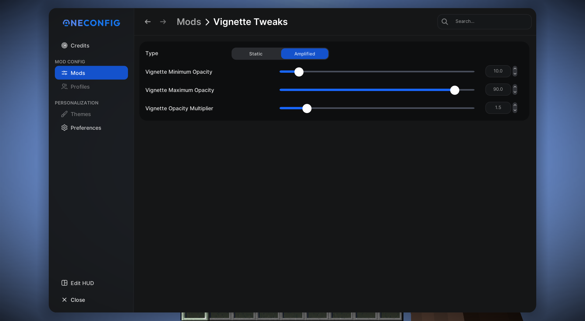

## Vignette Tweaks

A mod that allows you to customize vignette. Inspired by [CheatBreaker](https://cheatbreaker.net).

---

## Features
- Types: Static & Amplified
- Static allows you to set a static opacity.
- Amplified allows you to change the amplification of the vanilla effect.

## Config
Vignette Tweaks utilizes OneConfig

---

[license](LICENSE), [modrinth](https://modrinth.com/mod/vignette-tweaks), [codeberg](https://codeberg.org/LibreMC/VignetteTweaks)